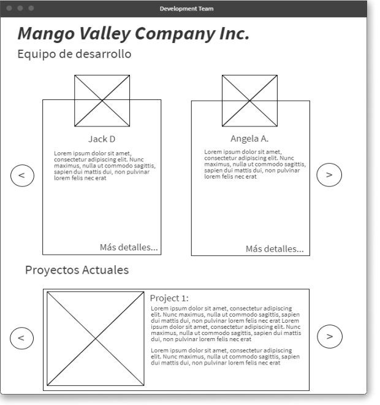
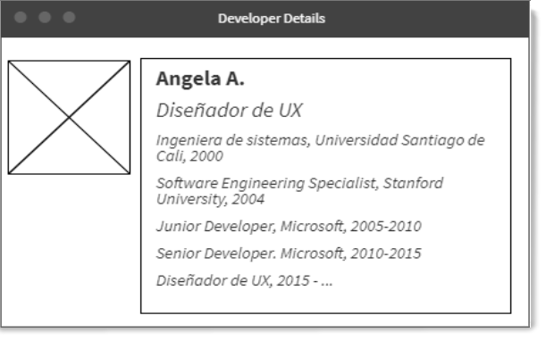
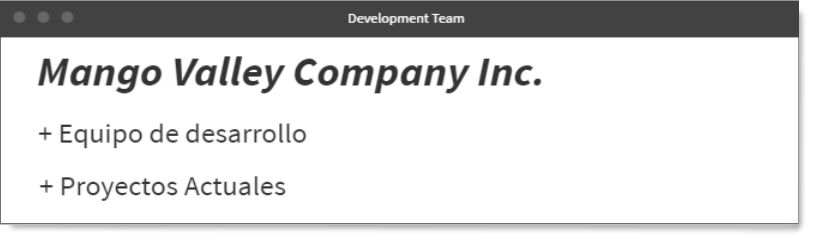

# Universidad Santiago de Cali
## Programación Orientada a la Web – 2020A
---
###### Examen Práctico 1 – Marzo de 2020

1. Información acerca de 3 proyectos (pueden 
ser académicos) y equipo de desarrollo (de 5 
personas, pueden ser compañeros de la U) para 
una compañía tecnológica X, procurando seguir
la diagramación de la siguiente maqueta:

2. La información resumida que debe mostrarse 
de cada integrante del equipo es: Fotografía, 
Nombre, descripción del cargo. Al dar en “Mas 
detalles”, debe mostrarse una página con algunos
detalles adicionales: Nombre, historial académico,
historial laboral:

3. Bonus: Si las secciones se despliegan en un 
acordeón

